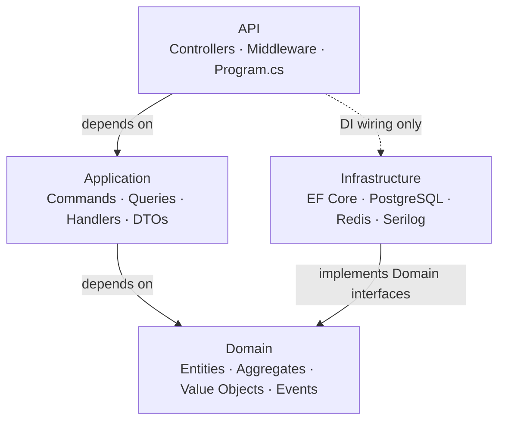

# EcommerceApi

> Production-grade multi-tenant e-commerce REST API built with ASP.NET Core .NET 10 and Clean Architecture.

[](https://github.com/lukaoxp/dotnet-ecommerce-api)


---

## Overview

EcommerceApi is a platform-style e-commerce API where each merchant operates as an isolated tenant. The project is designed to demonstrate architectural decision-making, production engineering practices, and deep knowledge of the ASP.NET Core ecosystem — from the request pipeline to observability.

**Domain:** multi-tenant e-commerce platform (products, orders, customers, authentication)  
**Tenancy model:** row-level isolation via EF Core Global Query Filters  
**Architecture:** Clean Architecture with Domain-Driven Design  

---

## Architecture



Dependencies point inward — Domain has zero external dependencies. Infrastructure implements Domain interfaces; the Domain never references Infrastructure.

---

## Tech Stack

| Layer            | Technology                                    |
| ---------------- | --------------------------------------------- |
| Runtime          | ASP.NET Core .NET 10                          |
| Database         | PostgreSQL 18 + Entity Framework Core         |
| Cache            | Redis OSS                                     |
| Resilience       | Polly (circuit breaker + retry)               |
| Logging          | Serilog (structured, JSON output)             |
| Observability    | OpenTelemetry · Prometheus · Grafana · Sentry |
| Documentation    | Scalar (OpenAPI)                              |
| Validation       | FluentValidation                              |
| Mapping          | Mapster + manual domain mapping               |
| Testing          | xUnit · Testcontainers · NSubstitute          |
| Containerization | Docker · Docker Compose · nginx               |
| CI/CD            | GitHub Actions                                |

---

## Patterns & Concepts

**Architecture**
- Clean Architecture with strict dependency rule enforcement via project references
- Domain-Driven Design — Aggregates, Value Objects, Domain Events, Ubiquitous Language
- CQRS (manual implementation, no MediatR) — Commands, Queries, Handlers, Dispatcher
- Repository + Unit of Work
- Outbox Pattern — guaranteed domain event delivery, solves the dual-write problem

**Multi-Tenancy**
- Row-level isolation via EF Core Global Query Filters
- Tenant resolution per request via HTTP header
- Zero cross-tenant data leakage enforced at the data access layer

**Security**
- JWT authentication built from scratch — token generation, validation, claims, roles
- Refresh tokens with short-lived access tokens (15 min) and long-lived refresh tokens (7 days)
- Refresh token rotation with reuse detection — compromised token invalidates the entire session family
- Refresh token stored in `HttpOnly; Secure; SameSite=Strict` cookie — inaccessible to JavaScript
- Logout revokes the refresh token family in PostgreSQL and adds the access token JTI to a Redis blocklist (TTL = remaining token lifetime)
- CORS policy per environment
- Rate limiting (built-in .NET 10 middleware)
- Idempotency keys on order and payment endpoints
- TLS termination at reverse proxy (nginx/IIS) + `ForwardedHeaders` middleware
- Secrets management via environment variables and GitHub Secrets

**Data & Reliability**
- Optimistic concurrency via EF Core row versioning
- Cursor-based pagination (O(1) regardless of offset)
- Retry with exponential backoff (Polly)
- Circuit breaker pattern
- Graceful shutdown — drains in-flight requests before process exit

**Observability**
- Structured logging with correlation IDs (Serilog → JSON)
- Distributed tracing (OpenTelemetry → Jaeger/Grafana Tempo)
- Metrics (Prometheus + Grafana dashboards)
- Error tracking (Sentry)
- Health check endpoints (`/healthz/live`, `/healthz/ready`) — Kubernetes-compatible

**API Design**
- API versioning — backwards-compatible contract evolution
- Problem Details responses (RFC 7807)
- Scalar-generated OpenAPI documentation

**Compliance (LGPD + GDPR)**
- Column-level encryption for PII fields (CPF, phone, address) via EF Core Value Converters
- Soft delete with 24-hour grace period — flagged records can be restored before expiration
- Irreversible anonymization after grace period for PII entities (Customer, Tenant)
- Hard delete after grace period for non-PII entities (Product)
- Audit trail on sensitive data access
- `ISoftDeletable` and `IAnonymizable` as generic domain interfaces

**Testing**
- TDD on domain layer and CQRS handlers (Red → Green → Refactor)
- Unit tests: pure domain logic, zero infrastructure dependencies
- Integration tests: real PostgreSQL + Redis via Testcontainers, spun up per test run

---

## Project Structure

```
src/
  EcommerceApi.Api/             # HTTP layer — controllers, middleware, DI wiring
  EcommerceApi.Application/     # Use cases — commands, queries, handlers, DTOs
  EcommerceApi.Domain/          # Business rules — entities, aggregates, interfaces
  EcommerceApi.Infrastructure/  # Technical details — EF Core, Redis, external services

tests/
  EcommerceApi.Domain.Tests/        # Unit tests — domain logic, TDD (no infrastructure)
  EcommerceApi.Application.Tests/   # Unit tests — CQRS handlers, TDD (mocked repos)
  EcommerceApi.Integration.Tests/   # Integration tests — real DB + Redis via Testcontainers

nginx/
  nginx.conf                    # Reverse proxy config — TLS termination, upstream to API

.github/
  workflows/
    ci.yml                      # Build + test on every push/PR

Dockerfile                      # Multi-stage build (SDK → runtime, non-root user)
docker-compose.yml              # Local orchestration — API, PostgreSQL, Redis, nginx
EcommerceApi.sln
```

---

## Getting Started

### Prerequisites

- [.NET 10 SDK](https://dotnet.microsoft.com/download)
- [Docker Desktop](https://www.docker.com/products/docker-desktop/)

### Run with Docker Compose

```bash
docker compose up -d
```

This starts PostgreSQL, Redis, Prometheus, Grafana, and the API behind nginx.

### Run locally

```bash
# Start dependencies
docker compose up postgres redis -d

# Run the API
cd src/EcommerceApi.Api
dotnet run
```

API available at `http://localhost:5000`  
Documentation at `http://localhost:5000/scalar`

### Environment variables

Copy `.env.example` to `.env` and fill in the required values before running.

---

## Running Tests

```bash
# Unit tests
dotnet test --filter "Category=Unit"

# Integration tests (requires Docker)
dotnet test --filter "Category=Integration"

# All tests
dotnet test
```

Integration tests spin up isolated PostgreSQL and Redis containers via Testcontainers — no manual setup required.

---

## Observability

| Tool          | URL                             | Purpose              |
| ------------- | ------------------------------- | -------------------- |
| Scalar        | `http://localhost:5000/scalar`  | API documentation    |
| Grafana       | `http://localhost:3000`         | Metrics dashboards   |
| Prometheus    | `http://localhost:9090`         | Metrics scraping     |
| Health checks | `http://localhost:5000/healthz` | Liveness + readiness |

---

## CI/CD

GitHub Actions pipeline runs on every push:

1. Build and restore
2. Run unit tests
3. Run integration tests
4. Build Docker image
5. Push to registry (on `main` branch)

---

## License

MIT
